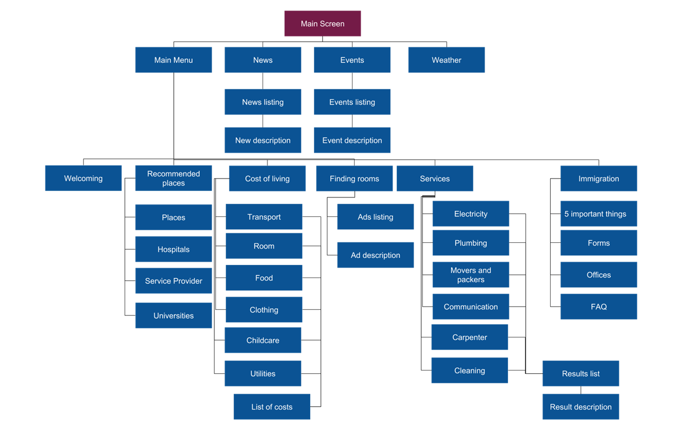
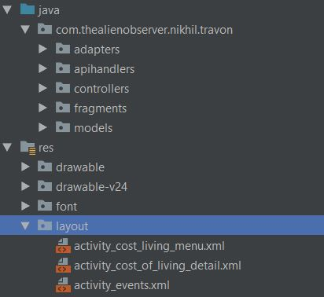
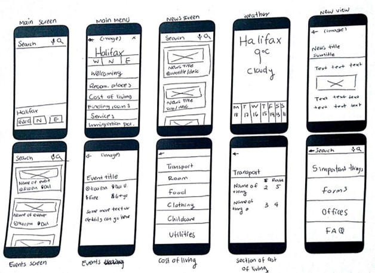
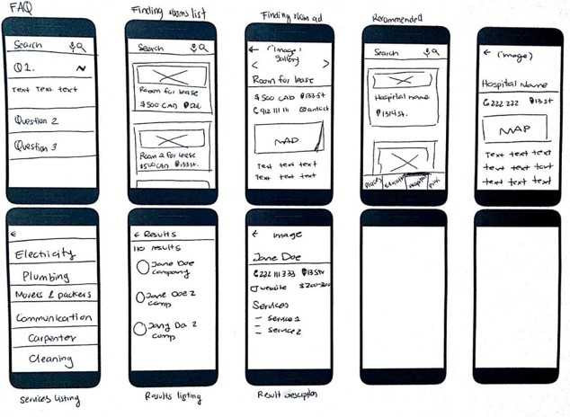
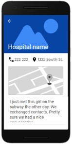

# Travon
<!-- TOC depthFrom:1 depthTo:6 withLinks:1 updateOnSave:1 orderedList:0 -->

- [Travon](#travon)
	- [Group members](#group-members)
	- [How to access to the repository](#how-to-access-to-the-repository)
	- [Installation Notes](#installation-notes)
		- [Requirements](#requirements)
	- [Summary](#summary)
	- [Scope](#scope)
	- [Users](#users)
	- [Purpose and Benefits](#purpose-and-benefits)
	- [Technical matters](#technical-matters)
		- [Libraries](#libraries)
		- [API](#api)
	- [Features](#features)
		- [Welcoming](#welcoming)
		- [Immigration Information](#immigration-information)
		- [News](#news)
		- [Weather](#weather)
		- [Events](#events)
		- [Cost of Living](#cost-of-living)
		- [Recommended Places](#recommended-places)
		- [Finding rooms](#finding-rooms)
		- [Search Functionality](#search-functionality)
		- [Services](#services)
	- [Sitemap](#sitemap)
	- [Architecture](#architecture)
		- [API Handlers, Adapters and Fragments](#api-handlers-adapters-and-fragments)
	- [Prototyping](#prototyping)
		- [Low fidelity prototype](#low-fidelity-prototype)
		- [High fidelity prototype](#high-fidelity-prototype)
	- [Clickstreams](#clickstreams)
		- [Weather](#weather)
		- [Events](#events)
		- [News](#news)
		- [Immigration](#immigration)
		- [Services](#services)
		- [Finding rooms](#finding-rooms)
		- [Recommended places](#recommended-places)
		- [Services](#services)
	- [Project management](#project-management)
	- [Task Assignment](#task-assignment)
	- [Version control](#version-control)
	- [Travon Test Cases](#travon-test-cases)
	- [Final Project Status](#final-project-status)
		- [Minimum Functionality](#minimum-functionality)
		- [Expected Functionality](#expected-functionality)
		- [Bonus Functionality](#bonus-functionality)
	- [Code Examples](#code-examples)
	- [Sources](#sources)

<!-- /TOC -->

## Group members

| Name                       | B00 number | Email               |
| -------------------------- | ---------- | ------------------- |
| Genny Andrea Centeno Metri | B00786201  | gn936133@dal.ca     |
| Richa Khatri               | B00792218  | rc801868@dal.ca     |
| Jamuna Loganath            | B00811590  | jm284791@dal.ca     |
| Nikhil Tyagi               | B00809791  | nikhil.tyagi@dal.ca |
| Dheeraj Varshney           | B00808467  | dh301823@dal.ca     |
| Charley LeBlanc            | B00727183  | ch875607@dal.ca     |

## How to access to the repository

-   Click [here](https://git.cs.dal.ca/metri/mobile-comp-project) or clone the code from repository and pull the latest changes.

```sh
git clone https://git.cs.dal.ca/metri/mobile-comp-project.git
```

-   Open project in Android Studio
-   Make your changes
-   Build project and run the code
-   If you have _Developer_ permissions, you have to create a branch before committing or pushing your code.
-   Commit Changes
-   Push changes
-   Create a merge request.

## Installation Notes

Installation instructions for markers.

### Requirements

-   **Android Studio**: This is an android studio project.
-   **Java**: Java programming language is used. Download the latest version.
-   **Git**: Git is used for code versioning and collaboration.

## Summary

Travon will help users to ease their difficulties, problems or issues they may face while moving to a new city. Users will be able to know the place better with anticipation and can prepare accordingly; they can also use the application during their stay in the new city. Travon will be a location based and informative app with features such as receiving news and events of that area, interesting facts about that place, and recommended places to visit such as hotels, hospitals, universities, and stores. Other features include finding rooms using GPS, performing search using voice recognition or typing, and getting important information regarding immigration policies.

## Scope

Users will be able to use most of the functionalities in anywhere of the world, except for Finding Rooms which will be available in Halifax, Toronto and Vancouver; and Immigration which will be available in Canada. Immigration Information is something which varies for different countries. Further in the future, the API will be extended so it covers other cities and countries apart from the initial ones.

## Users

The proposed application will attract people who are planning to move or travel for a long time to a city different to where they reside. Most importantly, our app will assist the inhabitants of any city including landed immigrants, temporary residents, work permit holders, students, and tourist visa holders to know more about the city in their daily lives.

## Purpose and Benefits

The purpose of our proposed application is to provide users with all the essential information that one should know before and after they arrive at the new city for them, all within the same application.  

Relocation and travelling are always challenging. Usually, when people plan to come to a new city, they will have various questions/doubts concerning their preparations, weather, things to know, things to do, finding accommodations, understanding culture & geography of the city, attractions, entertainment, bus connectivity, as well as immigration rules, regulations, and guidelines.

To find out the answers for these, they will have to visit various websites and collect information from all those sites separately. Working on various sites could be overwhelming and baffling for users. All information in one application indorses simplicity and could possibly save a lot of time.  
As our app will have all information for a visitor/traveler, by using our app people can plan every activity such as finding a place to stay, selecting a place according to preferred neighborhood & bus connectivity, relish their favorite cuisine at the nearest restaurant, getting involved with their community events, plan for their favorite sports games, etc.

## Technical matters

### Libraries

**Volley**: Volley is an HTTP library that makes networking for Android apps easier and most importantly, faster. Volley is available on [GitHub](https://developer.android.com/training/volley/).

**Bumptech Glide**: Glide is a fast and efficient open source media management and image loading framework for Android that wraps media decoding, memory and disk caching, and resource pooling into a simple and easy to use interface. Bumptech Glide is available on [Github](https://github.com/bumptech/glide).

### API

 **Google Maps API**: this library allows you to access to the functionalities provided by Google Maps to mark places and get the users' location.  [Go to site](https://cloud.google.com/maps-platform/?hl=en)

-   Places: Help users discover the world with rich details for over 150 million points of interest.
-   Services: Provides information about the services provided in the selected city.

**Numbeo**: Numbeo API provides access to prices and other data from Numbeo.com. Currently uses JSON interchangable data output, so it can be used in various platforms or systems.

**OpenWeather API**: This API allows you to access current weather data for any location on Earth. Current weather is frequently updated based on global models and data from more than 40,000 weather stations. Data is available in JSON, XML, or HTML format. [Go to site](https://openweathermap.org/)

**NewsAPI**: Simple HTTP REST API for searching and retrieving live articles from all over the web. [Go to site](https://newsapi.org/docs)

**Mocked API for Finding Rooms and Immigration**: We created an API deployed in Heroku that provides information for Finding Rooms and Immigration functionalities.

## Features

### Welcoming
 The welcoming is a summary of the information regarding the selected city. Welcoming shows the user information such as scores regarding certain categories such as cost of living, healthcare, transporting, etc.

### Immigration Information
In countries like Canada and USA, there is a lot of immigration and people are always searching for this information in the wrong places. Mostly, immigrants are unaware of their rights and responsibilities. It will also help as more people will have correct knowledge, avoiding any last-minute issues.

### News
The News feature is an important feature which makes us aware about the place we are visiting and prepare accordingly. This functionality shows the news directly related to the selected city.

### Weather
Shows the current weather of the city. This feature also shows next five days' weather report of the location chosen by the user. Using it, a user can choose what clothes they should take with them.     

### Events
Some of the best experiences are made outside and knowing about the on going events can help users can embrace the locality and make friends. Events can be of several genres like music festivals, geek coding night, or just a barbeque party organized in the locality nearby.

### Cost of Living
A person who is planning to move or is about to and wants to know the monthly expenditure for themselves and their family, can use this feature to get an estimation. We know that spending is highly subjective, but this feature gives you the approximate cost of living. Based on the location entered by the user, it will show different costs such as rentals, grocery, apartment price, as well as basic prices of heat, water, and electricity.

### Recommended Places
Recommended Places will let the user know about places around the city and outskirts that are famous/historical. It will help the user to get information about various parks, wildlife sanctuaries, waterfronts, museums, and parks. It displays four categories: Places, Hospitals, Restaurants, and Universities.

### Finding rooms
This feature will help the people moving to a different country or province as well as living in a different locality. It will list all the rooms with their pictures, address, and cost. The prices will be accurate to give a clear picture to the user about the type of houses available and they can decide accommodation on that basis.

### Search Functionality
The user can just type in the search bar or can give a voice command to select a city and they will get the answer accordingly. It uses voice recognition techniques and understands what you say, and it will reply to you accordingly.

### Services
These are services that help you get things done around your residence. It will use your GPS location like some of the previous features to give you the location and phone number of the closest services you require. If there are multiple of the same services, it will give you a description of their working hours, price, and other details.


## Sitemap

At the moment of planning a mobile application, creating a sitemap will help ensure the team has included all the screens needed to cover the proposed functionalities. The following sitemap shows the navigation the user can go through within the application. It shows the hierarchy of screens and functionalities available for each feature.




## Architecture

**Model-View-Controller (MVC)**

The Model-View-Controller (MVC) is an architectural pattern that separates an application into three main logical components: the model, the view, and the controller. Each of these components are built to handle specific development aspects of an application. MVC is one of the most frequently used industry-standard web development framework to create scalable and extensible projects.[2]

**Components**


**Model**

The Model component corresponds to all the data-related logic that the user works with. This can represent either the data that is being transferred between the View and Controller components or any other business logic-related data. For all features we have created a model which contains respective data of that feature.


**View**

The View component is used for all the UI logic of the application. For example, the Customer view will include all the UI components such as text boxes, dropdowns, etc. that the final user interacts with.

For our project we have different screens for e.g. We have Main menu screen where user will be presented with the options like News, Events or Weather. We also have a longer menu with other options such as Cost Of Living, Services and Immigration Info. Additionally, we have views to get more specific details of certain sections. The design of the layouts depend on the feature they were developed for.

**Controller**

Controllers act as an interface between Model and View components to process all the business logic and incoming requests, manipulate data using the Model component and interact with the Views to render the final output.  

For Travon, we have used different activities like MainActivity, MenuActivity, NewsActivity, RecommendedPlacesActivity, etc.

### API Handlers, Adapters and Fragments

Additionally from the typical MVC components, we have added other resources such as Handlers and Adapters. Handlers are in charge of making the requests to their respective API. Adapters are in charge of showing the retrieved information in their respective view. Fragments are a type of layout that assists when creating tabbed views.



## Prototyping

### Low fidelity prototype

Low fidelity prototype was helpful to get a better idea of how the application would look once implemented and how the information and functionalities could be organized and displayed throughout the application.




### High fidelity prototype

As part of the design project, the high fidelity prototype was created from the low fidelity prototype.





## Clickstreams

Click stream can be seen as a roadmap of a user’s activity. The following click streams show the screens sequences the user might follow while using the mobile application.

### Weather

There are two possible ways to access to the weather screen. You can directly access from main screen or from the main menu screen.


### Events

There are two possible ways to access to the events screen. You can directly access from main screen or from the main menu screen.


### News

There are two possible ways to access to the news screen. You can directly access from main screen or from the main menu screen


### Immigration


### Services


### Finding rooms


### Recommended places


### Services


## Project management

## Task Assignment

In order to be able to carry the project progress more accurately, Trello was chosen as a tool for distributing tasks and responsibilities,. Trello is a project management software with web interface, client for iOS and android to organize projects [1].
Trello’s UI makes it easy to create and assign tasks; and keep track of its status. Cards are added at the beginning of each update section. In case there was a previous section, the pending tasks are evaluated in order to be able to include them in the next section planning.


## Version control

Code is being submitted to a repository on Git Lab. There are 6 members, where the team leader is a Maintainer and the rest of team are as developers.

The url of the repository is: <https://git.cs.dal.ca/metri/mobile-comp-project> .
In order to push new changes to the repository, if the user has a _Developer_ permission, a merge request has to be created.

## Travon Test Cases

<<<<<<< HEAD
The test cases can be seen []()<https://git.cs.dal.ca/metri/mobile-comp-project/Travon_TestCases.xlsx>
=======
The test cases can be seen [here](https://git.cs.dal.ca/metri/mobile-comp-project/blob/master/Travon_TestCases.xlsx)
>>>>>>> d8b63d0b818723e83aee347c8a939c0242da51f2


## Final Project Status

At the end, we managed to complete all our minimum, expected and one of our proposed bonus functionalities.
At the moment, Immigration feature works only for Canada. Also, Finding Rooms only has information for cities such as Halifax, Toronto and Vancouver. For future work, we would like to expand these sections such to be available everywhere in the world as the rest of the functionalities. We would also like to keep improving our User Interfaces and User Experience to provide a better service for the user


### Minimum Functionality

-  Welcoming  (Completed)
-  Immigration (Completed)

### Expected Functionality

-   News (Completed)
-   Weather  (Completed)
-   Events  (Completed)
-   Cost of Living (Completed)
-   Recommended Places (Completed)
-   Finding rooms (Completed)
-   Search Functionality (Completed)


### Bonus Functionality

-   Services (Completed)
-   Bus stops (Not Implemented)

## Code Examples

**Problem 1: Access to filtered results from CostOfLivingDetailActivity Controller**

The results from filtering by category the API results for Cost of Living were needed on the controller in order to show them on the view. The solution was turning CostOfLivingHandler into a Singleton class to have access to results without performing the API call more than once. Since all the categories are retrieved with the same API call, it did not make sense to do the request more than once.

```java
public class CostOfLivingHandler {
  // more code ...

  /**
  * Singleton method
  *
  * @param context
  * @return
  */
  public static synchronized CostOfLivingHandler getInstance(Context context) {
    if (mInstance == null) {
        mInstance = new CostOfLivingHandler(context.getApplicationContext());
    }
    return mInstance;
  }

  // more code ...

  /**
     * Getters for the categories results array
     */
    public ArrayList getFood() {
        return mFood;
    }

    public ArrayList getTransportation() {
        return mTransportation;
    }

    public ArrayList<CostOfLivingItem> getUtilities() {
        return mUtilities;
    }

    public ArrayList<CostOfLivingItem> getRoom() {
        return mRoom;
    }

    public ArrayList<CostOfLivingItem> getClothing() {
        return mClothing;
    }

    public ArrayList<CostOfLivingItem> getChildcare() {
        return mChildcare;
    }

}

```

## Sources

What to include in your project sources:

-   Stock images
-   Design guides
-   Programming tutorials
-   Research material
-   Android libraries
-   Everything listed on the Dalhousie Plagiarism and Cheating pages(<https://www.dal.ca/dept/university_secretariat/academic-integrity/plagiarism-cheating.html>)

[1]"Trello", Es.wikipedia.org, 2018. [Online]. Available: https://es.wikipedia.org/wiki/Trello. [Accessed: 31- Oct- 2018]
[2]"MVC Framework Introduction", www.tutorialspoint.com, 2018. [Online]. Available: https://www.tutorialspoint.com/mvc_framework/mvc_framework_introduction.htm. [Accessed: 28- Oct- 2018]


//To do: Format references with IEEE
[2] <https://help.github.com/articles/organizing-information-with-tables/>

[3] Strings documentation <https://developer.android.com/guide/topics/resources/string-resource?hl=es-419>

<https://www.tutorialspoint.com/Java-Ternary-Operator-Examples>

https://help.github.com/articles/creating-and-highlighting-code-blocks/

icons from https://www.freepik.com/

https://material.io/tools/icons/?style=baseline

https://www.apress.com/gp/book/9781430246145

[11]Doc.lagout.org, 2018. [Online]. Available: https://doc.lagout.org/programmation/Android/Android%20Recipes_%20A%20Problem-Solution%20Approach%20%283rd%20ed.%29%20%5BSmith%20%26%20Friesen%202014-02-05%5D.pdf. [Accessed: 05- Dec- 2018].
