# Travon

- [Group members](#group-members)
- [How to access to the repository](#how-access-to-the-repository)
- [Installation Notes](#installation-notes)
  * [Requirements](#requirements)
- [Summary](#summary)
- [Scope](#scope)
- [Purpose and Benefits](#purpose-and-benefits)
- [Technical matters](#technical-matters)
  * [Libraries](#libraries)
  * [API](#api)
  * [Code Examples](#code-examples)
- [Features](#features)
- [Summary](#summary)
- [Summary](#summary)


## Group members

| Name  | B00 number | Email |
| ------------- | ------------- | ------------- |
| Genny Andrea Centeno Metri  | B00786201  | gn936133@dal.ca  |
| Richa Khatri  | B00792218  | rc801868@dal.ca  |
| Jamuna Loganath  | B00811590  | jm284791@dal.ca  |
| Nikhil Tyagi  | B00809791  | nikhil.tyagi@dal.ca  |
| Dheeraj Varshney  | B00808467  | dh301823@dal.ca  |
| Charley LeBlanc  | B00727183  | ch875607@dal.ca  |


## How to access to the repository

- Download the code from repository. Or pull the latest changes.
```sh
git clone https://git.cs.dal.ca/metri/mobile-comp-project.git
```
- Open project in Android Studio
- Make your changes
- Build project and run the code
- If you have _Developer_ permissions, you have to create a branch before committing or pushing your code.
- Commit Changes
- Push changes
- Create a merge request.

## Installation Notes
Installation instructions for markers.

### Requirements
- **Android Studio**: This is an android studio project.
- **Java**: Java programming language is used. Download the latest version.
- **Git**: Git is used for code versioning and collaboration.


## Summary
Travon will help users to ease their difficulties, problems or issues they may face while moving to a new city. Users will be able to know the place better with anticipation and can prepare accordingly; they can also use the application during their stay in the new city. Travon will be a location based and informative app with features such as receiving news and events of that area, interesting facts about that place, and recommended places to visit such as hotels, hospitals, universities, and stores. Other features include finding rooms using GPS, performing search using voice recognition or typing, and getting important information regarding immigration policies.

## Scope
Users will be able to use most of the functionalities in anywhere of the world, except for Finding Rooms which will be available in Halifax, Toronto and Vancouver; and Immigration which will be available in Canada. Immigration Information is something which varies for different countries. Further in the future, the API will be extended so it covers other cities and countries apart from the initial ones.

## Users
The proposed application will attract people who are planning to move or travel for a long time to a city different to where they reside. Most importantly, our app will assist the inhabitants of any city including landed immigrants, temporary residents, work permit holders, students, and tourist visa holders to know more about the city in their daily lives.

## Purpose and Benefits
The purpose of our proposed application is to provide users with all the essential information that one should know before and after they arrive at the new city for them, all within the same application.  

Relocation and travelling are always challenging. Usually, when people plan to come to a new city, they will have various questions/doubts concerning their preparations, weather, things to know, things to do, finding accommodations, understanding culture & geography of the city, attractions, entertainment, bus connectivity, as well as immigration rules, regulations, and guidelines.

To find out the answers for these, they will have to visit various websites and collect information from all those sites separately. Working on various sites could be overwhelming and baffling for users. All information in one application indorses simplicity and could possibly save a lot of time.  
As our app will have all information for a visitor/traveler, by using our app people can plan every activity such as finding a place to stay, selecting a place according to preferred neighborhood & bus connectivity, relish their favorite cuisine at the nearest restaurant, getting involved with their community events, plan for their favorite sports games, etc.


## Technical matters
### Libraries
**Volley**: Volley is an HTTP library that makes networking for Android apps easier and most importantly, faster. Volley is available on [GitHub](https://developer.android.com/training/volley/).

**Bumptech Glide**: Glide is a fast and efficient open source media management and image loading framework for Android that wraps media decoding, memory and disk caching, and resource pooling into a simple and easy to use interface. Bumptech Glide is available on [Github](https://github.com/bumptech/glide).

### API

 **Google Maps API**: this library allows you to access to the functionalities provided by Google Maps to mark places and get the users' location.  [Go to site](https://cloud.google.com/maps-platform/?hl=en)
  - Places: Help users discover the world with rich details for over 150 million points of interest.
  - Services: Provides information about the services provided in the selected city.

**Numbeo**: Numbeo API provides access to prices and other data from Numbeo.com. Currently uses JSON interchangable data output, so it can be used in various platforms or systems.

**OpenWeather API**: This API allows you to access current weather data for any location on Earth. Current weather is frequently updated based on global models and data from more than 40,000 weather stations. Data is available in JSON, XML, or HTML format. [Go to site](https://openweathermap.org/)

**NewsAPI**: Simple HTTP REST API for searching and retrieving live articles from all over the web. [Go to site](https://newsapi.org/docs)

**Mocked API for Finding Rooms and Immigration**: We created an API deployed in Heroku that provides information for Finding Rooms and Immigration functionalities.


### Code Examples
You will encounter roadblocks and problems while developing your project. Share 2-3 'problems' that your team solved while developing your project. Write a few sentences that describe your solution and provide a code snippet/block that shows your solution. Example:

**Problem 1: We needed a method to calculate a Fibonacci sequence**

A short description.
```
// The method we implemented that solved our problem
public static int fibonacci(int fibIndex) {
    if (memoized.containsKey(fibIndex)) {
        return memoized.get(fibIndex);
    } else {
        int answer = fibonacci(fibIndex - 1) + fibonacci(fibIndex - 2);
        memoized.put(fibIndex, answer);
        return answer;
    }
}

// Source: Wikipedia Java [1]
```
##Sitemap
At the moment of planning a mobile application, creating a sitemap will help ensure the team has included all the screens needed to cover the proposed functionalities. The following sitemap shows the navigation the user can go through within the application. It shows the hierarchy of screens and functionalities available for each feature.


##Travon Test Cases
### Home page Test Cases

### Project architecture

**Model-View-Controller (MVC)**

The Model-View-Controller (MVC) is an architectural pattern that separates an application into three main logical components: the model, the view, and the controller. Each of these components are built to handle specific development aspects of an application. MVC is one of the most frequently used industry-standard web development framework to create scalable and extensible projects.[2]

**MVC Components**

Following are the components of MVC −

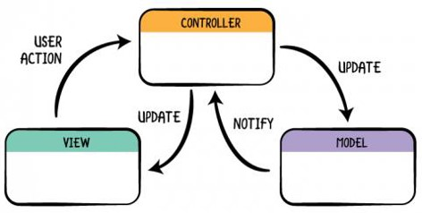


**Model**

The Model component corresponds to all the data-related logic that the user works with. This can represent either the data that is being transferred between the View and Controller components or any other business logic-related data.  

In this project, our model is basically related to location and all the data depends on the location.

**View**

The View component is used for all the UI logic of the application. For example, the Customer view will include all the UI components such as text boxes, dropdowns, etc. that the final user interacts with.

For our Project we have different screens for e.g. We have Main menu screen where user will be presented with the options like News.5 Things to Do, Cost Of Living. Services and Immigration Info. so as to navigate to that particular section. Similarly, we have designed screen for other sections as well like if user navigates to Immigration Info section, he will be able to view other options pertaining to that.  

**Controller**

Controllers act as an interface between Model and View components to process all the business logic and incoming requests, manipulate data using the Model component and interact with the Views to render the final output.  

For Travon, we have used different activities like MainScreen, MenuScreen, NewsScreen, Recommended Places Screen, Recommended Places Activity

### API Handlers and Adapters
For now we have used News Handler and Recommended Places Handler.Adapters used are News Card Adapter and Recommended Places Adapter.


##Prototyping
### Low fidelity prototype
Low fidelity prototype was helpful to get a better idea of how the application would look once implemented and how the information and functionalities could be organized and displayed throughout the application.


### High fidelity prototype
As part of the design project, the high fidelity prototype was created from the low fidelity prototype.

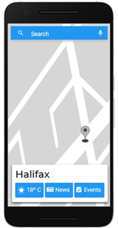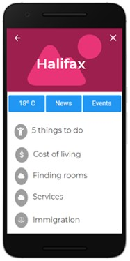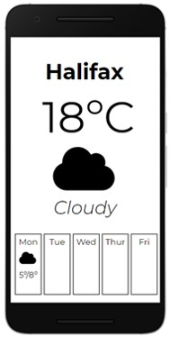

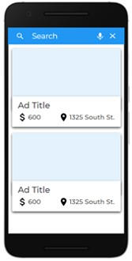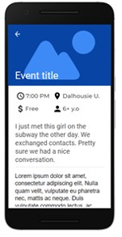
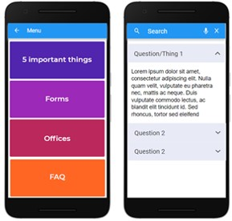
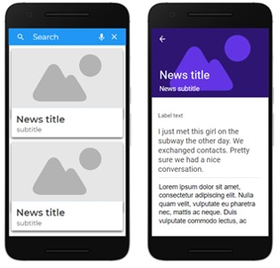
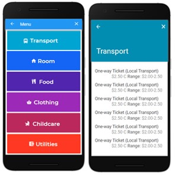

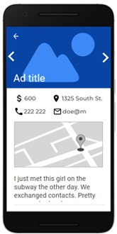
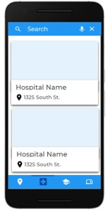
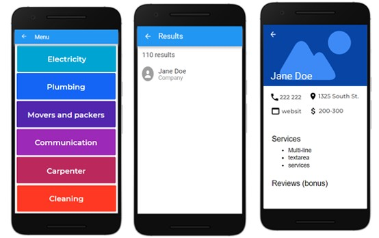

## Clickstreams
Click stream can be seen as a roadmap of a user’s activity. The following click streams show the screens sequences the user might follow while using the mobile application.
### Weather
There are two possible ways to access to the weather screen. You can directly access from main screen or from the main menu screen.

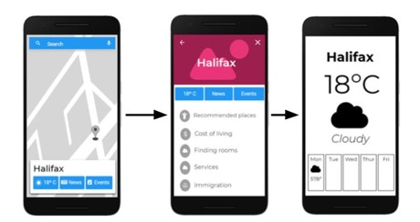
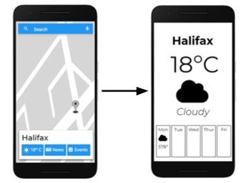

### Events
There are two possible ways to access to the events screen. You can directly access from main screen or from the main menu screen.
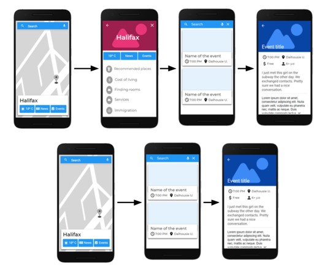
### News
There are two possible ways to access to the news screen. You can directly access from main screen or from the main menu screen
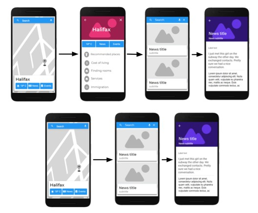

### Immigration
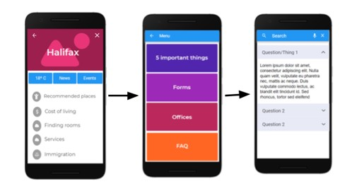
### Services
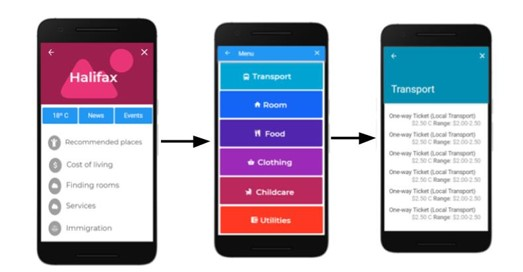
### Finding rooms
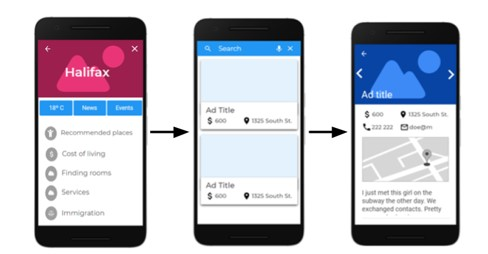
### Recommended places
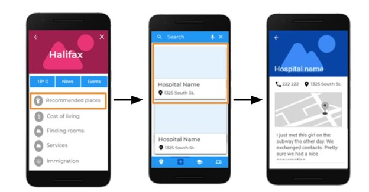
### Services
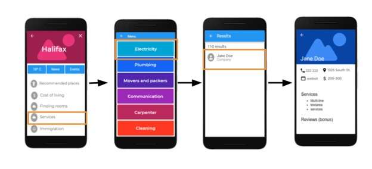
## Project management
## Task Assignment
In order to be able to carry the project progress more accurately, Trello was chosen as a tool for distributing tasks and responsibilities,. Trello is a project management software with web interface, client for iOS and android to organize projects [1].
Trello’s UI makes it easy to create and assign tasks; and keep track of its status. Cards are added at the beginning of each update section. In case there was a previous section, the pending tasks are evaluated in order to be able to include them in the next section planning. See Figure n for an example of the team’s trello board.

## Version control
Code is being submitted to a repository on Git Lab. There are 6 members, where the team leader is a Maintainer and the rest of team are as developers.  The url of the repository is: https://git.cs.dal.ca/metri/mobile-comp-project .
In order to push new changes to the repository, a merge request has to be created. After, 3 members have to check the request and if the three approve, then the code can be pushed.


## Features
List all the main features of your application with a brief description of each feature.

## Final Project Status
Write a description of the final status of the project. Did you achieve all your goals? What would be the next step for this project (if it were to continue)?

#### Minimum Functionality
- Feature 1 name (Completed)
- Feature 2 name (Partially Completed)
- Feature 3 (Not Implemented)

#### Expected Functionality
- Feature 1 name (Completed)
- Feature 2 name (Partially Completed)
- Feature 3 (Not Implemented)

#### Bonus Functionality
- Feature 1 name (Completed)
- Feature 2 name (Partially Completed)
- Feature 3 (Not Implemented)

## Sources
What to include in your project sources:
- Stock images
- Design guides
- Programming tutorials
- Research material
- Android libraries
- Everything listed on the Dalhousie Plagiarism and Cheating pages(https://www.dal.ca/dept/university_secretariat/academic-integrity/plagiarism-cheating.html)

[1] "Java (programming language)", En.wikipedia.org, 2018. [Online]. Available: https://en.wikipedia.org/wiki/Java_(programming_language).

//To do: Format references with IEEE
[2] https://help.github.com/articles/organizing-information-with-tables/

[3] Strings documentation https://developer.android.com/guide/topics/resources/string-resource?hl=es-419
